# terraform-with-azure test

Download GIT 

Install Azure CLI : https://learn.microsoft.com/en-us/cli/azure/install-azure-cli

Download Latest Version
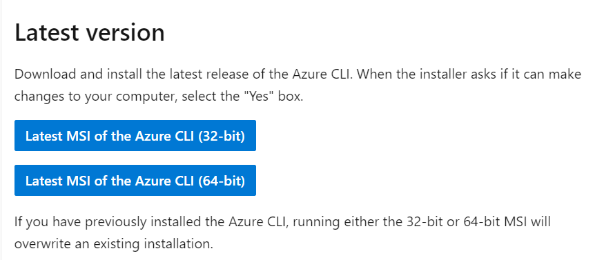

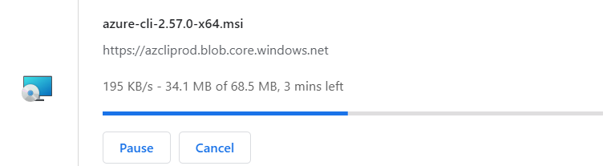

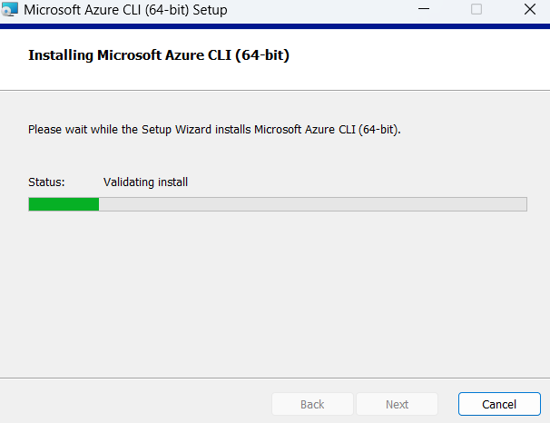

open cmd and run az login

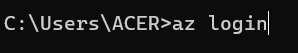

Select your AZ account

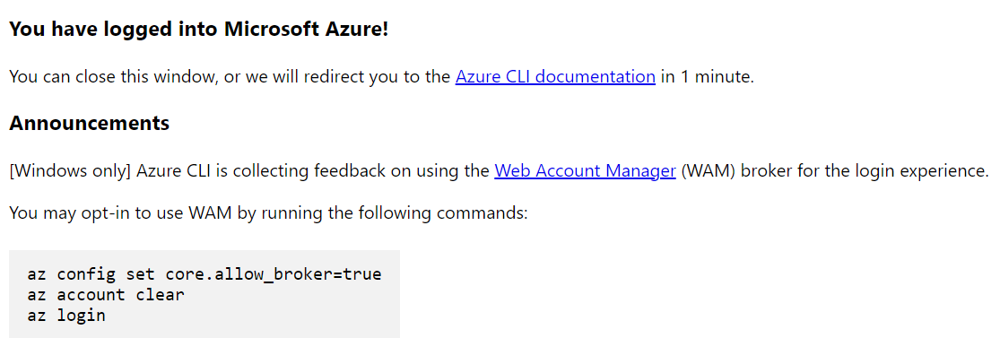

Login Successful

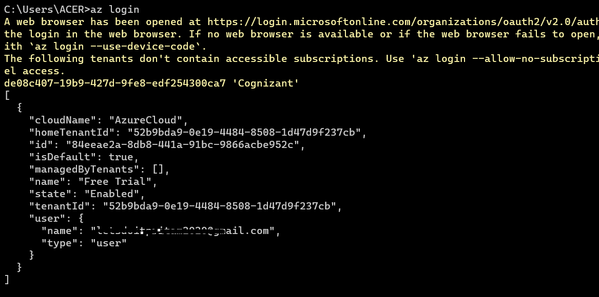

Install Terraform CLI : https://developer.hashicorp.com/terraform/install

Download AMD64 

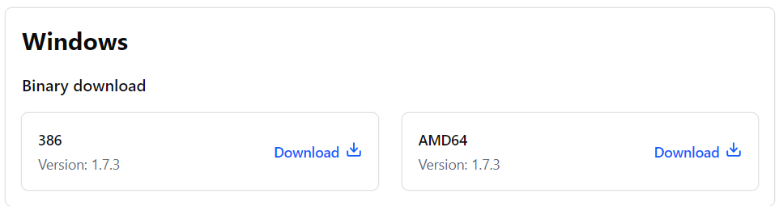

Extract the zip file, then create a bin folder in the c drive (any name we can create) and paste the terraform.exe file

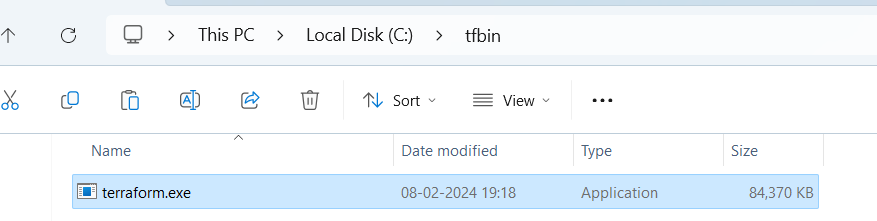

Then open environment variable and add the path inside the system variable Path

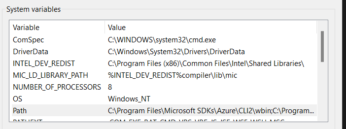

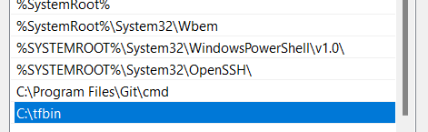

Now, open the cmd and check the terraform version

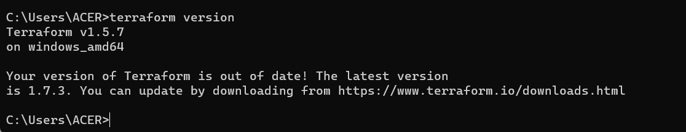

Install Terraform plugin for VS Code : https://marketplace.visualstudio.com/items?itemName=HashiCorp.terraform

Click on Install 

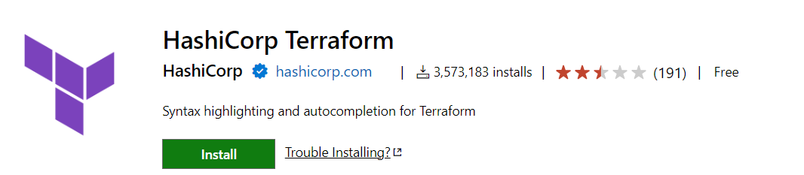

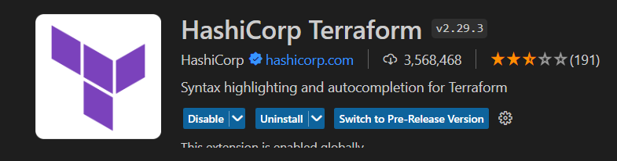

